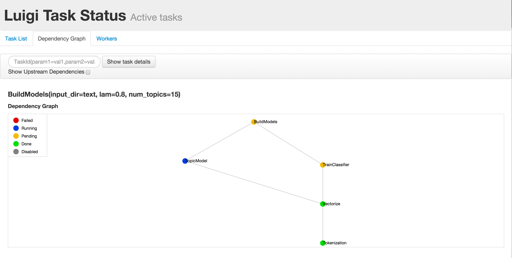

# Data Engineering 101: Building a Data Pipeline

This repository contains the files and data from a workshop at PARISOMA well as resources around Data Engineering.

I would love your feedback on the materials in the Github [issues](https://github.com/Jay-Oh-eN/data-engineering-101/issues).  And/or please do not hesitate to reach out to me directly via email at jonathan@galvanize.it or over twitter @clearspandex

The presentation can be found on Slideshare [here](http://www.slideshare.net/jonathandinu/presentation-45784222) or in this repository (`presentation.pdf`).

> Throughout this workshop, you will learn how to make a scalable and sustainable data pipeline in Python with Luigi

## Getting Started

0. Install Python, I recommend Anaconda (Mac OSX or Windows): [http://continuum.io/downloads](http://continuum.io/downloads)
1. Get the files: Download the [ZIP](https://github.com/Jay-Oh-eN/data-engineering-101/archive/master.zip) or `git clone https://github.com/Jay-Oh-eN/data-engineering-101` (git [tutorial](http://jlord.us/git-it/)) this repository.

### Run the Code

1. Install libraries and dependencies: `pip install -r requirements.txt`
2. Start the UI server: `luigid --background  --logdir logs`
3. Navigate with a web browser to `http://localhost:[port]` where `[port]` is the port the `luigid` server has started on (`luigid` defaults to port 8082)
4. Run the final pipeline: `python ml-pipeline.py BuildModels --input-dir text --num-topics 10 --lam 0.8`

### Libraries Used
* [luigi](http://luigi.readthedocs.org/en/latest/index.html)
* [scikit-learn](http://scikit-learn.org/stable/)
* [nltk](http://www.nltk.org/)
* [ipdb](https://github.com/gotcha/ipdb)

### Whats in here?

    text/                   20newsgroups text files
    example_luigi.py        example scaffold of a luigi pipeline
    hadoop_word_count.py    example luigi pipeline using Hadoop
    ml-pipeline.py          luigi pipeline covered in workshop
    LICENSE                 Details of rights of use and distribution
    presentation.pdf        lecture slides from presentation
    readme.md               this file!

## The Data

The data (in the `text/` folder) is from the [20 newsgroups](http://qwone.com/~jason/20Newsgroups/) dataset, a standard benchmarking dataset for machine learning and NLP.  Each file in `text` corresponds to a single 'document' (or post) from one of two selected [newsgroups](http://en.wikipedia.org/wiki/Usenet_newsgroup) (`comp.sys.ibm.pc.hardware` or `alt.atheism`).  The first line provides which group the document is from and everything thereafter is the body of the post.

    comp.sys.ibm.pc.hardware
    I'm looking for a better method to back up files.  Currently using a MaynStream
    250Q that uses DC 6250 tapes.  I will need to have a capacity of 600 Mb to 1Gb
    for future backups.  Only DOS files.

    I would be VERY appreciative of information about backup devices or
    manufacturers of these products.  Flopticals, DAT, tape, anything.  
    If possible, please include price, backup speed, manufacturer (phone #?), 
    and opinions about the quality/reliability.

    Please E-Mail, I'll send summaries to those interested.

    Thanx in advance,

## Resources/References

* [Questioning the Lambda Architecture](http://radar.oreilly.com/2014/07/questioning-the-lambda-architecture.html)
* [Luigi: NYC Data Science Meetup](http://www.slideshare.net/erikbern/luigi-presentation-nyc-data-science)
* [The Log: What every software engineer should know about real-time data's unifying abstraction](http://engineering.linkedin.com/distributed-systems/log-what-every-software-engineer-should-know-about-real-time-datas-unifying)
* [I (heart) Log](http://www.slideshare.net/JayKreps1/i-32858698)
* [Why Loggly Loves Apache Kafka](https://www.loggly.com/blog/loggly-loves-apache-kafka-use-unbreakable-messaging-better-log-management/)
* [Buffer's New Data Architecture](https://overflow.bufferapp.com/2014/10/31/buffers-new-data-architecture/)
* [Putting Apache Kafka to Use](http://blog.confluent.io/2015/02/25/stream-data-platform-1/)
* [Metric Driven Development](http://blog.librato.com/posts/2014/7/16/metrics-driven-development)
* [The Unified Logging Infrastructure for Data Analytics at Twitter](http://vldb.org/pvldb/vol5/p1771_georgelee_vldb2012.pdf)
* [Stream Processing and Mining just got more interesting](http://radar.oreilly.com/2013/09/stream-processing-and-mining-just-got-more-interesting.html)
* [How to Beat the CAP Theorem](http://nathanmarz.com/blog/how-to-beat-the-cap-theorem.html)
* [Beating the CAP Theorem Checklist](http://ferd.ca/beating-the-cap-theorem-checklist.html)

## License

Copyright 2015 Jonathan Dinu.

All files and content licensed under [Creative Commons Attribution-NonCommercial-ShareAlike 4.0 International Public License](LICENSE)